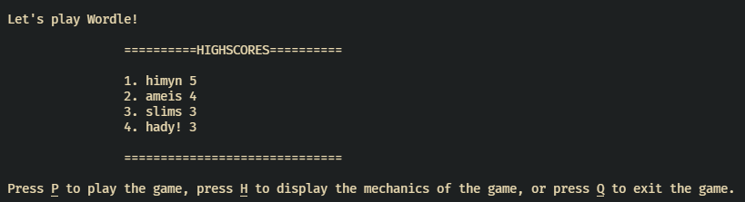
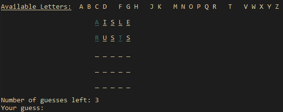

# WordleClone
Own implementation of Wordle as a CLI app.

## Preview



## Note
Running this program in Window's Command Prompt may display unsatisfactory visuals.
If you're running this in Windows, use Powershell (built-in in Windows 10) or other
terminal emulator apps such as Git Bash.

## How to Build
```
cargo install wordle_clone
```

## How to Play
* Run `wordle_clone` in the command-line.
* If you're not familiar with the game, 
  Press `H` at the start of the game to view the game mechanics.

## What's new with version 0.1.4
* Added a high score feature.

## Dependencies
The _colored_ library for providing convenience function for printing colored
text in the terminal.
