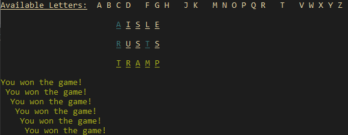

# WordleClone
Own implementation of Wordle as a CLI app. This uses the _colored_ library
to pretty-print its output.





## How to Build
```
cargo install wordle_clone
```

## How to Play
Press `H` at the start of the game to view the mechanics of the game.
