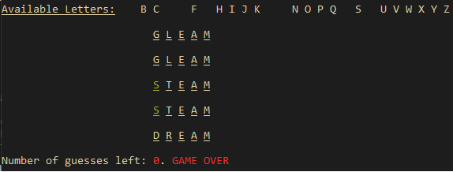

# WordleClone
Own implementation of Wordle as a CLI app.

## How to Build
Run `cargo install wordle_clone`.

## How to Play
* Run `wordle_clone` in your command-line. 
* If you're not familiar with the game, 
  Press `H` at the start of the game to view the game mechanics.

If running `wordle_clone` doesn't work, make sure that 
`$HOME/.cargo/bin` is included in your system's `PATH`. See 
[this](https://doc.rust-lang.org/book/ch14-04-installing-binaries.html) for
further information.

## Dependencies
The _colored_ library for providing convenience function for printing colored
text in the terminal.